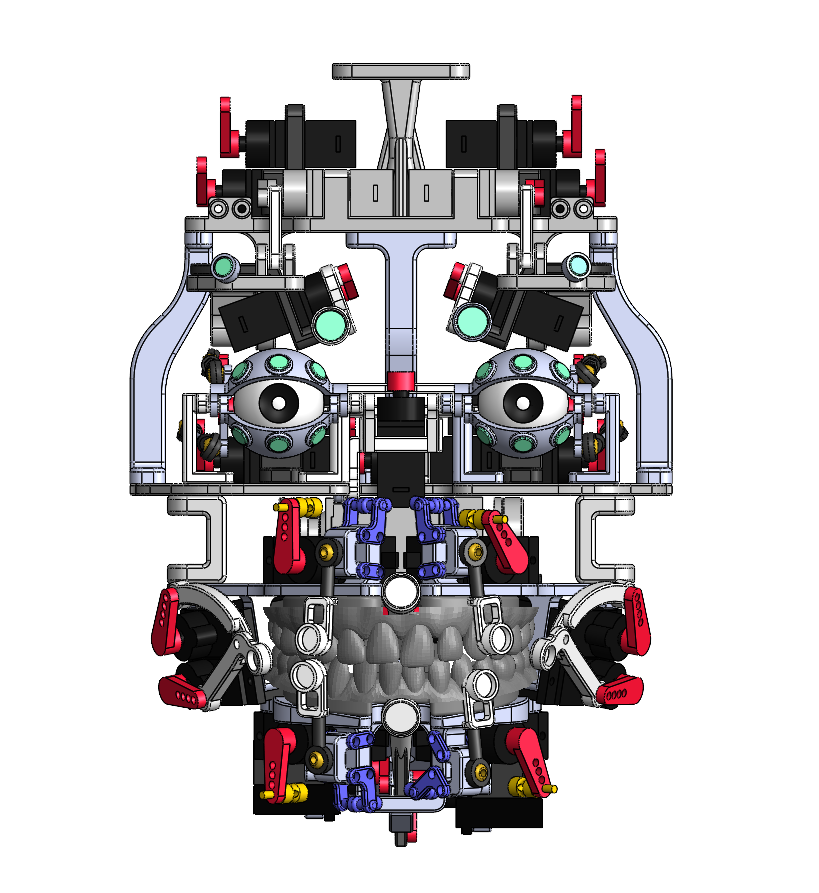
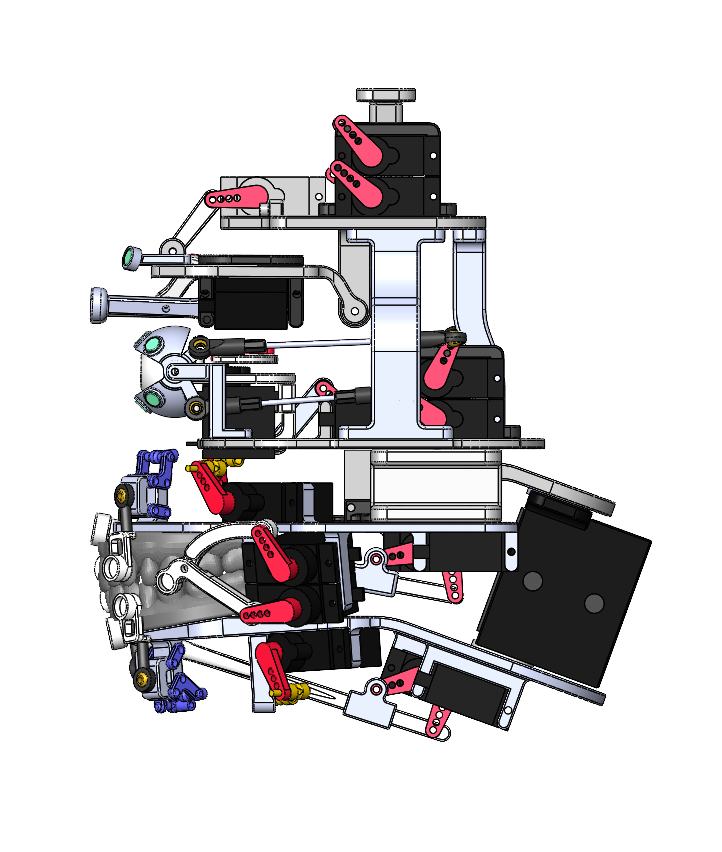
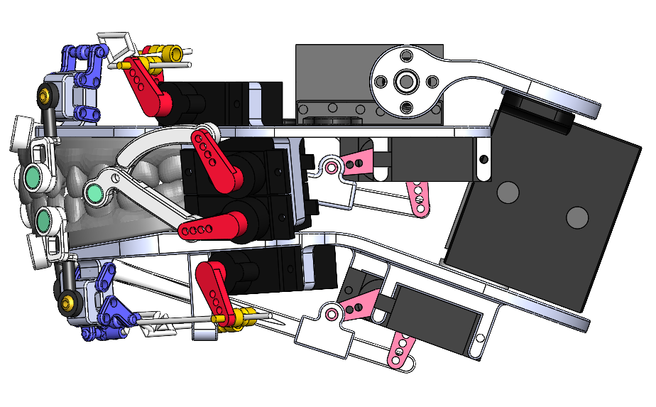
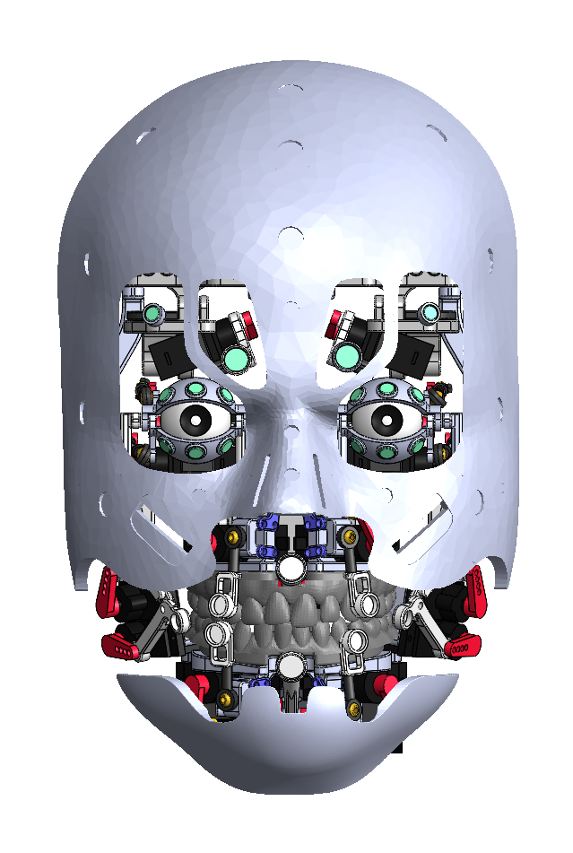
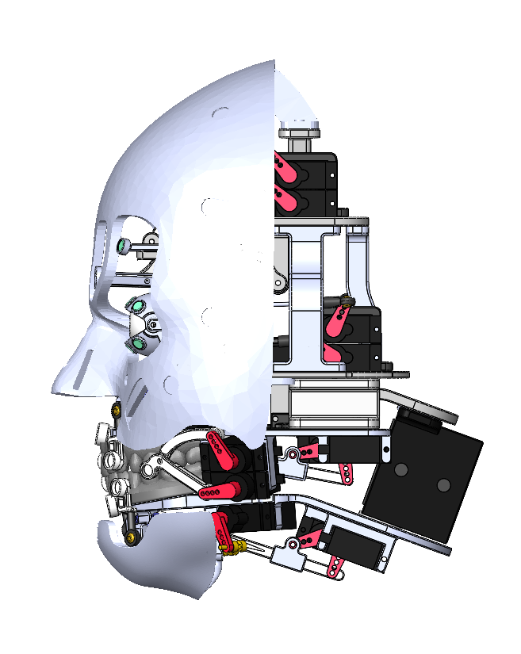
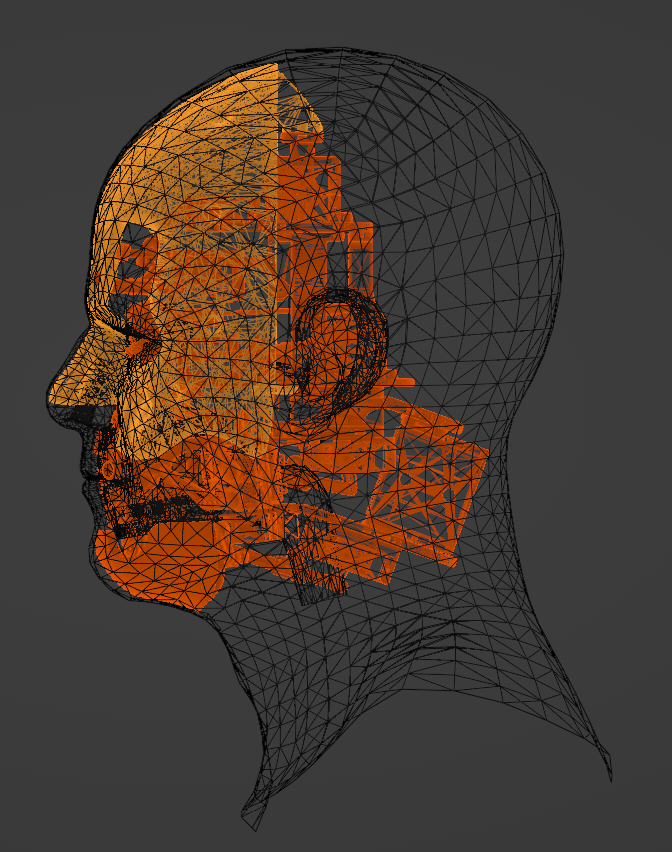
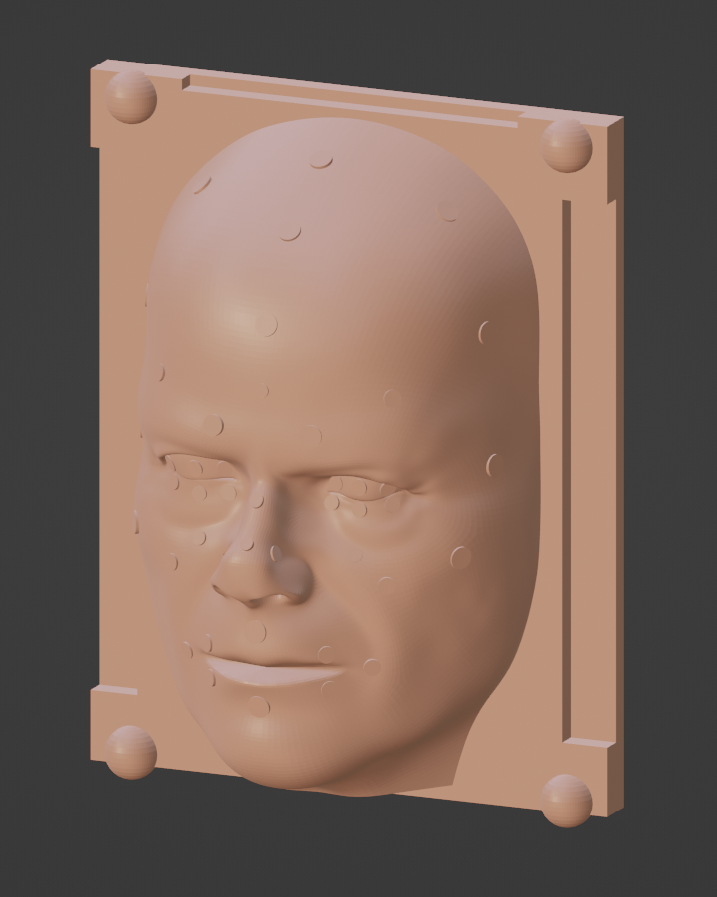
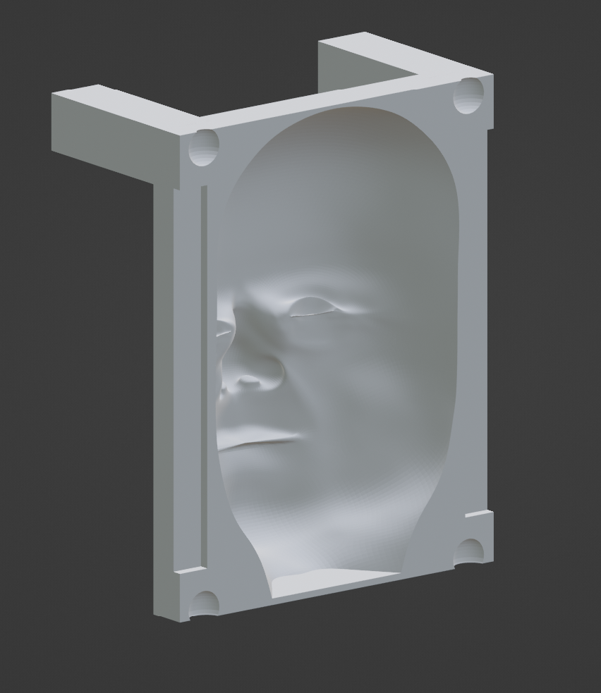
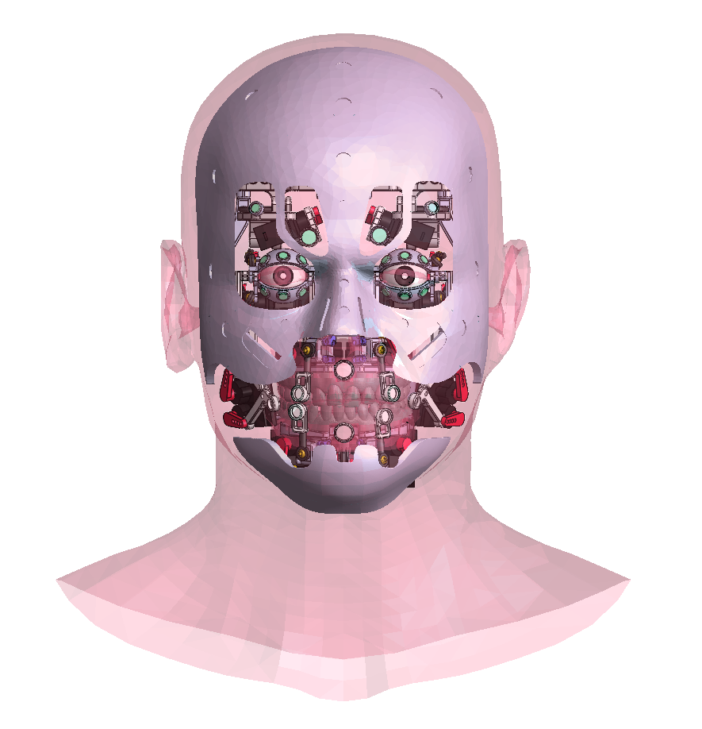
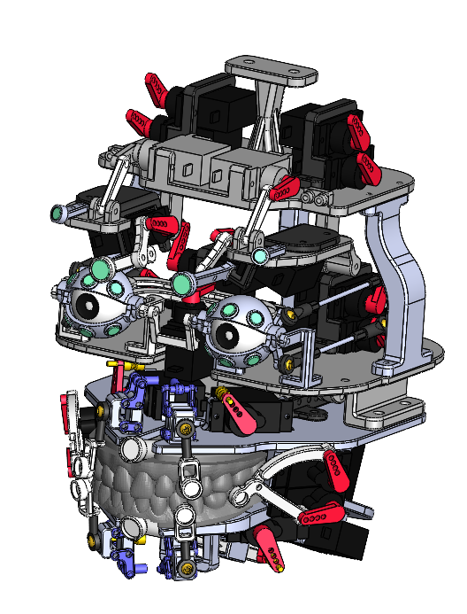

# Iceland Cobbler Face Robot

这是一个人脸机器人外观与机构探索项目的开源展示材料。项目目前主要包含整机 STL 文件和部分设计过程图片，后续会继续补充结构设计、外壳设计、硅胶面具制作等过程记录。

本仓库更偏向“项目展示”和“设计过程记录”，不是一个可以直接复现的完整工程包。后续如果整理到足够完整，可以继续补充装配说明、BOM、打印参数和控制方案。

## 项目结构

```text
.
├─ full_assembly_stl/   # 整机拆分导出的 STL 文件
├─ images/              # 项目图片、渲染图、过程图
└─ README.md
```

## 1. 结构设计

这一部分用于记录人脸机器人内部机构的设计思路，包括表情机构、嘴部机构、眼部/面部支撑结构，以及各模块之间的装配关系。

可以放的内容：

- 整体机构正视图、侧视图、斜视图
- 嘴巴机构细节
- 关键运动副或连杆机构说明
- 设计取舍，例如空间限制、强度、安装方式、维护方式

<p>
  
  
  
</p>

## 2. 外壳设计

这一部分用于记录外壳如何包裹内部机构，以及外壳和内部结构之间如何避让、固定和装配。

可以放的内容：

- 带外壳的整体效果
- 外壳和内部机构的相对位置
- 外壳分件方式
- 外壳安装点、磁吸/螺丝/卡扣等固定方式
- Blender 或其他软件中的外形调整过程

<p>
  
  
  
</p>

## 3. 硅胶面具

这一部分用于记录硅胶面具相关内容，包括内外模具、面具成型过程、面具与外壳/机构之间的配合关系。

可以放的内容：

- 内模具和外模具
- 硅胶面具成型过程
- 面具厚度、柔软度、贴合方式
- 面具和嘴部/眼部区域的避让
- 面具安装到机器人后的效果

<p>
  
  
  
</p>

## 4. STL 文件

`full_assembly_stl/` 中保存的是从装配体中拆分导出的 STL 文件。当前文件主要用于展示和后续整理，不保证已经具备完整的打印、装配和复现说明。

后续可以继续补充：

- 哪些 STL 属于同一个模块
- 哪些零件需要 3D 打印
- 哪些零件只是参考外形
- 打印方向、支撑、材料建议
- 关键尺寸和装配注意事项

## 如何在 README 中插入图片

图片建议统一放在 `images/` 文件夹里，然后用相对路径引用：

```md

```

如果图片文件名包含中文、空格或特殊符号，GitHub 通常也能显示，但为了长期维护更稳定，建议后续逐步改成英文或拼音命名，例如：

```text
images/overall_front.png
images/mouth_mechanism_side.png
images/silicone_outer_mold.png
```

对应的 README 写法：

```md

```

如果想让很多图片并排显示，可以用 HTML：

```html
<p>
  
  
  
</p>
```

## 后续整理计划

- [ ] 整理结构设计图片和说明
- [ ] 整理外壳设计图片和说明
- [ ] 整理硅胶面具制作流程
- [ ] 给 STL 文件按模块分组或补充命名说明
- [ ] 补充设计背景和项目目标
- [ ] 补充装配注意事项

## 说明

这个项目来自个人对人脸机器人外观和机构设计的探索。当前仓库主要用于展示设计能力、记录项目过程，以及为后续继续完善人脸机器人项目提供参考。
